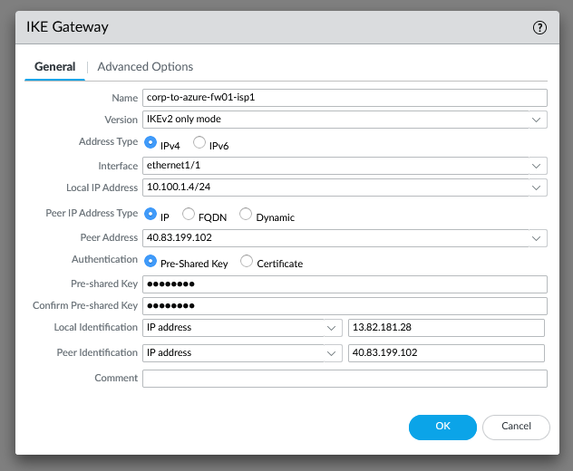

# Standard VPN Deployment with BGP

This is a standard deployment with a single edge device (or traditional HA pair) with two internet connections connecting to a pair of active/active firewalls in Azure. The guide will cover the configuration of the VPN tunnels and the BGP configuration to ensure traffic is taking the same path to and from on-prem.

This guide uses a Palo Alto firewall to simulate the customer edge. In reality, it could be any device that supports IPSec, IKEv2, and BGP. The following instructions will show how to configure this on a Palo Alto firewall.

## Customer Edge VPN Configuration

The VPN configuration is the first step to getting everything connected. You will need the following information - I've provided the information I used during the configuration as an example which will match the screenshots.

```bash
Customer Edge Information
ISP#1 Public IP - 13.82.181.28
ISP#1 Provider - Azure
ISP#2 Public IP - 20.121.193.219
ISP#2 Provider - Azure

Azure Firewall 01 Information
Untrust Public IP - 40.83.199.102
Untrust Private IP - 10.0.2.101

Azure Firewall 02 Information
Untrust Public IP - 13.73.38.48
Untrust Private IP - 10.0.2.201

Pre-Shared-Key = Coretekpsk
```

### IKE Crypto

Network -> Network Profiles -> IKE Crypto

In these screenshots, we used the default settings, which may not meet the requirements of your deployment. It is recommended you create a new profile to match the requirements for your installation. It is important that settings match between peers.


### IPSec Crypto

Network -> Network Profiles -> IKE Crypto

Similar to IKE Crypto, we used the default profile, however, a new profile for your deployment should be used. It is important that these settings match between peers.


### IKE Gateways

Network -> Network Profiles -> IKE Gateways

This configuration simulates the customer edge device having two Internet connections which will be used to connect to the Azure firewalls. This results in a total of 4 tunnels, which are added here. Ikev2 is suggested in most VPN deployments and is used in these screenshots as well. 

Here is a summary of the configuration for all 4 tunnels:


Since Azure NATs the public IP to a private IP on the Palo Alto firewalls, it is required to configure the "Local Identification" and "Peer Identification" values using the real public IPs of the firewalls.

Here is a screenshot of the full configuration:



### Tunnel Interfaces

The tunnel interfaces are used to route the VPN traffic through a security zone and virtual router. The tunnel interfaces do not typically require IP addresses, however, when using BGP, they are required.

Start by identifing the tunnel interface IPs. These IP addresses are only used by the firewalls and do not need to be routeable for the rest of the network.

```bash
corp-to-azure-fw01-isp1 -> Azure 10.255.255.1/30 - Corp = 10.255.255.2/30
corp-to-azure-fw02-isp1 -> Azure 10.255.255.5/30 - Corp = 10.255.255.6/30
corp-to-azure-fw01-isp2 -> Azure 10.255.255.9/30 - Corp = 10.255.255.10/30
corp-to-azure-fw02-isp2 -> Azure 10.255.255.13/30 - Corp = 10.255.255.14/30
```


### Zones

It is recommended that the VPN traffic be configured for their own zone to ensure the correct security policies are used to filter traffic. For these screenshots, you will see we used the "trust" zone for testing.

### IPSec Tunnels

The IPSec Tunnel configuration brings all of the configuration together. Here is a screenshot of the IPsec tunnel configurations for our setup.


There is no reason to configure the Proxy IDs when using this deployment type, which is commonly called "route-based" vs. "policy-based". Our tunnels show green, however, they will be red until you configure BGP or send traffic over the tunnel.

#### Summary

This is the end of the configuration for the customer edge until the other side of the VPN tunnels can be created, which is in subsequent sections.

## Azure Firewall 01 VPN Configuration

Similar to the customer edge, the Ike Crypto, IPSec Crypto, Ike Gateways, tunnels and IPSec tunnels need to be created. Here are the details from the Azure side of the configuration.

### Ike Crypto

The default profile can be used matching the settings of the customer edge device. If you created a custom profile, make sure the settings match.


### IPSec Crypto

The default profile can be used matching the settings of the customer edge device. If you created a custom profile, make sure the settings match.


### IKE Gateways

These are configured to match the customer edge tunnels - here is a screenshot of the Azure side.


### Tunnel Interfaces

These are configured the same as the customer edge, just using the other IP address in the subnet.


### Zones

Similar to the edge device, the VPN traffic should be routed through a dedicated zone, however, we used the "trust" zone for this example.

### IPSec Tunnels

The IPSec Tunnels are configured the same as the edge site, just with the correct IP information.


## Azure Firewall 02 VPN Configuration

Similar to the customer edge, the Ike Crypto, IPSec Crypto, Ike Gateways, tunnels and IPSec tunnels need to be created. Here are the details from the Azure side of the configuration.

### Ike Crypto

The default profile can be used matching the settings of the customer edge device. If you created a custom profile, make sure the settings match.


### IPSec Crypto

The default profile can be used matching the settings of the customer edge device. If you created a custom profile, make sure the settings match.


### IKE Gateways

These are configured to match the customer edge tunnels - here is a screenshot of the Azure side.


### Tunnel Interfaces

These are configured the same as the customer edge, just using the other IP address in the subnet.


### Zones

Similar to the edge device, the VPN traffic should be routed through a dedicated zone, however, we used the "trust" zone for this example.

### IPSec Tunnels

The IPSec Tunnels are configured the same as the edge site, just with the correct IP information.


## Virtual Router Configuration - Customer Edge

This is the setup guide for BGP. This does not account for other requirements such as redistribution of routes from other protocols or more advanced configuration. The objective of this BGP configuration is to ensure that traffic is using the same tunnel in both directions and that failover is automatic to another tunnel if required.

### Enable BGP

Network -> Virtual Routers -> Default -> BGP

We used the "default" router for the inside traffic, make sure you configure the same router as your tunnel interfaces. This does not cover the configuration of multiple BGP virtual routers.

You will need to define a BGP AS number in the range of 64512 – 65535, which is the private BGP range. Make sure you enable the BGP process and select the "install route" option. Authentication was not enabled during this example, however, should be used in production environments.


### BGP Peer Groups

Peer Groups are used to connect the firewalls via BGP. Create a new BGP group and add the peers.


### Redistribution Profiles

Network -> Virtual Routers -> Redistribution Profile

For this example, we're redistribute all static routes into BGP. Here is a simple redistribution profile. Make sure you choose the option to "Redist". This is not a one-size-fits all deployment. This may require some fine tuning to accomplish the desired results.


