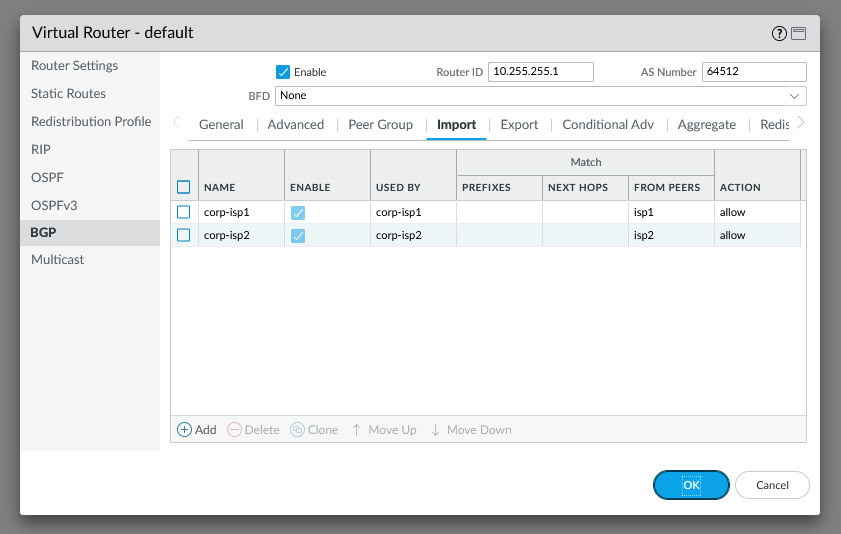

# Standard VPN Deployment with BGP

This is a standard deployment with a single edge device (or traditional HA pair) with two internet connections connecting to a pair of active/active firewalls in Azure. The guide will cover the configuration of the VPN tunnels and the BGP configuration to ensure traffic is taking the same path to and from on-prem.

This guide uses a Palo Alto firewall to simulate the customer edge. In reality, it could be any device that supports IPSec, IKEv2, and BGP. The following instructions will show how to configure this on a Palo Alto firewall.

## Customer Edge VPN Configuration

The VPN configuration is the first step to getting everything connected. You will need the following information - I've provided the information I used during the configuration as an example which will match the screenshots.

```bash
Customer Edge Information
ISP#1 Public IP - 13.82.181.28
ISP#1 Provider - Azure
ISP#2 Public IP - 20.121.193.219
ISP#2 Provider - Azure

Azure Firewall 01 Information
Untrust Public IP - 40.83.199.102
Untrust Private IP - 10.0.2.101

Azure Firewall 02 Information
Untrust Public IP - 13.73.38.48
Untrust Private IP - 10.0.2.201

Pre-Shared-Key = Coretekpsk
```

### IKE Crypto

Network -> Network Profiles -> IKE Crypto

In these screenshots, we used the default settings, which may not meet the requirements of your deployment. It is recommended you create a new profile to match the requirements for your installation. It is important that settings match between peers.


### IPSec Crypto

Network -> Network Profiles -> IKE Crypto

Similar to IKE Crypto, we used the default profile, however, a new profile for your deployment should be used. It is important that these settings match between peers.


### IKE Gateways

Network -> Network Profiles -> IKE Gateways

This configuration simulates the customer edge device having two Internet connections which will be used to connect to the Azure firewalls. This results in a total of 4 tunnels, which are added here. Ikev2 is suggested in most VPN deployments and is used in these screenshots as well. 

Here is a summary of the configuration for all 4 tunnels:


Since Azure NATs the public IP to a private IP on the Palo Alto firewalls, it is required to configure the "Local Identification" and "Peer Identification" values using the real public IPs of the firewalls.

Here is a screenshot of the full configuration:


### Tunnel Interfaces

The tunnel interfaces are used to route the VPN traffic through a security zone and virtual router. The tunnel interfaces do not typically require IP addresses, however, when using BGP, they are required.

Start by identifing the tunnel interface IPs. These IP addresses are only used by the firewalls and do not need to be routeable for the rest of the network.

```bash
corp-to-azure-fw01-isp1 -> Azure 10.255.255.1/30 - Corp = 10.255.255.2/30
corp-to-azure-fw02-isp1 -> Azure 10.255.255.5/30 - Corp = 10.255.255.6/30
corp-to-azure-fw01-isp2 -> Azure 10.255.255.9/30 - Corp = 10.255.255.10/30
corp-to-azure-fw02-isp2 -> Azure 10.255.255.13/30 - Corp = 10.255.255.14/30
```


### Zones

It is recommended that the VPN traffic be configured for their own zone to ensure the correct security policies are used to filter traffic. For these screenshots, you will see we used the "trust" zone for testing.

### IPSec Tunnels

The IPSec Tunnel configuration brings all of the configuration together. Here is a screenshot of the IPsec tunnel configurations for our setup.


There is no reason to configure the Proxy IDs when using this deployment type, which is commonly called "route-based" vs. "policy-based". Our tunnels show green, however, they will be red until you configure BGP or send traffic over the tunnel.

#### Summary

This is the end of the configuration for the customer edge until the other side of the VPN tunnels can be created, which is in subsequent sections.

## Azure Firewall 01 VPN Configuration

Similar to the customer edge, the Ike Crypto, IPSec Crypto, Ike Gateways, tunnels and IPSec tunnels need to be created. Here are the details from the Azure side of the configuration.

### Ike Crypto

The default profile can be used matching the settings of the customer edge device. If you created a custom profile, make sure the settings match.


### IPSec Crypto

The default profile can be used matching the settings of the customer edge device. If you created a custom profile, make sure the settings match.


### IKE Gateways

These are configured to match the customer edge tunnels - here is a screenshot of the Azure side.


### Tunnel Interfaces

These are configured the same as the customer edge, just using the other IP address in the subnet.


### Zones

Similar to the edge device, the VPN traffic should be routed through a dedicated zone, however, we used the "trust" zone for this example.

### IPSec Tunnels

The IPSec Tunnels are configured the same as the edge site, just with the correct IP information.


## Azure Firewall 02 VPN Configuration

Similar to the customer edge, the Ike Crypto, IPSec Crypto, Ike Gateways, tunnels and IPSec tunnels need to be created. Here are the details from the Azure side of the configuration.

### Ike Crypto

The default profile can be used matching the settings of the customer edge device. If you created a custom profile, make sure the settings match.


### IPSec Crypto

The default profile can be used matching the settings of the customer edge device. If you created a custom profile, make sure the settings match.


### IKE Gateways

These are configured to match the customer edge tunnels - here is a screenshot of the Azure side.


### Tunnel Interfaces

These are configured the same as the customer edge, just using the other IP address in the subnet.


### Zones

Similar to the edge device, the VPN traffic should be routed through a dedicated zone, however, we used the "trust" zone for this example.

### IPSec Tunnels

The IPSec Tunnels are configured the same as the edge site, just with the correct IP information.


## Virtual Router Configuration - Customer Edge

This is the setup guide for BGP. This does not account for other requirements such as redistribution of routes from other protocols or more advanced configuration. The objective of this BGP configuration is to ensure that traffic is using the same tunnel in both directions and that failover is automatic to another tunnel if required.

### Enable BGP

Network -> Virtual Routers -> Default -> BGP

BGP can be used in many ways to dynamically exchange routes between Azure and On-prem. BGP uses an elborate process to identify the best route to and from a remote AS and destination network. One option is to use the AS path, which is the first thing BGP evaluates when identifying the best route. The AS path can be configured on the route advertiser side to influence the recieving side to favor one or more routes over others. The second option is local prefrence, which is on the route reciever side and can also be used to influece the routing table. Some environments may require the configuration of both AS prepending and local pref to achieve the routing goals.

We used the "default" router for the inside traffic, make sure you configure the same router as your tunnel interfaces. This does not cover the configuration of multiple BGP virtual routers.

You will need to define a BGP AS number in the range of 64512 – 65535, which is the private BGP range. Make sure you enable the BGP process and select the "install route" option. Authentication was not enabled during this example, however, should be used in production environments.

This configuration will use Local Pref to determine the correct routes and will configure local pref for all routes recieved from a peer. It is important to understand the tunnel usage order and ensure the configuration is set to achieve that configured order. For this example, we're using the following order.

1. corp-to-azure-fw01-isp1 - Local pref 4000
2. corp-to-azure-fw02-isp1 - Local pref 3000
3. corp-to-azure-fw01-isp2 - Local pref 2000
4. corp-to-azure-fw02-isp2 - Local pref 1000


### BGP Peer Groups

Each connection will require its own peer group as the import/export profiles are associated with the peer group. The peer group is used to connect the two devices via BGP and each peer group will have a single peer, which will reflect the single connection back to/from Azure.

Looking at the customer edge device first, we will need 4 peer groups all with a single peer configured. Here is a screenshot of the CE peer groups:


#### Customer Edge BGP Profiles

The import/export profiles can be used to influence the routing tables of the local and remote sides of the connection. It is important that both sides match and that the same path is used to and from the networks to ensure traffic is not lost or dropped. 

If you want to use AS Prepending, then you will need to configure an export profile and associated that accordingly to your peer group.

In this example, we're using Local Prefrence to control routes inbound to the local system. For that, we need a import profile. We will need a total of 4 import profiles on the customer edge device to accomodate the multiple tunnels and requirements. For this example, the new profile was named after the connection, this will help keep the configuration organized later. We also configured the match to look at the "from peers" of the peer on that connection. We then set the action to allow and set the local pref based on the values in the sections above.

Here is a summary of the import profiles on the customer edge:


Here is the match configuration. The match statements will need to be udpated to match the corresponding peers per import profile.


When looking at the remote routing table, you will see the routes are incomplete. This is because the next-hop IP address is not set by the Palo firewalls. This will require an export profile to be configured per connection as well setting the next hop IP to match the local tunnel interface IP. This was not done for this example and the routing table screenshots will show a "?" for the route type.

### Redistribution Profiles

Network -> Virtual Routers -> Redistribution Profile

For this example, we're redistribute all static routes into BGP. Here is a simple redistribution profile. Make sure you choose the option to "Redist". This is not a one-size-fits all deployment. This may require some fine tuning to accomplish the desired results. It is also recommended that you add a "no-redis" profile as well so you can quickly add the routes you do not want to redistribute - if required.


## Azure BGP Configuration

On the Azure side, we just need to configure peer groups for the two ISPs for the two seperate tunnels. It is important to match the local pref settings as on prem to ensure traffic is returned over the same interface/tunnel. We will also need to configure iBGP. This is required as there is a load balancer in front of the Palo Firewalls and the non-active VPN peer will need to send its traffic to the other firewall to traverse the VPN.

### Azure Firewall 01

Enable BGP - check the option to install the routes "This is important and not checked by default".


Next, configure the peer groups matching the configuration from the customer edge. We will also need a iBGP peer group, which will be used to peer to the other Azure Firewall.


Here are the details on the iBGP peer group configuration; essentially, its the same as a eBGP peer, but uses the same AS number vs. the AS number of the customer edge. You also have to select the iBGP type as well.


### Azure Firewall 01 Import Profiles

The import profiles are used to set the local pref for the inbound routes. This is used to determine which route to take back to the custer edge device. It is important that we use the same order of preference for the routes to the customer edge as from the customer edge.

Here we're using local pref to influence the routes. Here is an example of configuring import rules for Azure firewall 01.




Make sure the local pref setting is configured to match the customer edge side of the tunnel as well. These steps need to be repeated for ISP2 or the other tunnel.

## Azure Firewall 02

Its the same configuration as firewall 01, just requires the IPs, tunnels, and local pref settings to be updated to reflect the correct configuration. Here are the screenshots of firewall 02.


## Validation

Once everything is configured, its time to validate the configuration and that everything is functional. This will also include some troubleshooting steps which can be used to ensure you didnt miss anything along the way.

### Palo Alto Verification

First, check that all IPSec tunnels are green or healthy. This is required before BGP can even peer correctly.


Next, make sure all the BGP peers are established.


If you see anything other than established, BGP has not successfully connected. Check the VPN tunnels to ensure there are encaps and decaps and that traffic is being routed across. Verify the addressing and the peer configuration. Remove things like authentication or DPD to verify.


The local RIB can be used to see which routes the BGP process is learning. the Flag column will let you know which route was selected. Verify the route and peer match what you're expecting and that you have all the routes from all the peers as expected. In this example, the azure firewalls are advertising 10.0.1.0/24 and 10.172.192.0/24. We can see all of the routes from all four peers with the correct local pref values. 

If you're not seeing routes, check the azure firewalls to make sure they're advertising the routes. Check the redistribtuion profile to ensure it is connected and configured. You can use the local RIB on the advertising firewall to ensure routes are being advertised by the process. If you know the routes are being advertised out, but your customer edge is not seeing them, check the import profile to make sure you're not dropping routes there.


The routing table is what the firewall will actual use to send traffic. Check here to make sure you have a BGP route to the correct destinations, in this case, 10.0.1.0/24 and 10.172.192.0/24.

## Appendix

Here are a few items I changed from the orginal screenshots. Make sure the following configurations make it into your config's to resolve some potential problems.

Instead of using an export profile to mark the next hop as the self router, I found the option to do so in the bgp peer config. I was hoping this would resolve the "?" in the routing table for the routes. It doesnt appear to cause any problems, but wanted to try and remove it. Here is a screenshot of my peer groups with the setting applied.


It is also recommended that you use BFD - Bi-directional forwarding detection - for BGP on local networks. This can be used to accelerate the BGP timmers and detect outages and complete failover sooner. This was not enabled during the first sets of screenshots to eliminate it as a possible issue. Here is how that is configured.


If you want to set the BFD settings per peer, you can also be done under the peer configuration.


Authentication is also recommended to ensure unexpecter peers cannot change the routing table. The BGP auth profiles are configured at the BGP summary screen and then on each peer.


Set the name of the profile and provide a password. Next, you will need to configue the peers to use the auth profile.


